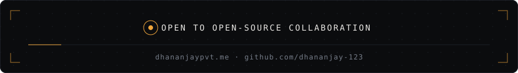

  

  
  
  
  

 

Frontend-focused full-stack engineer. I build interfaces with real systems behind them — design systems, dashboards that stay readable as data grows, real-time and offline state — and treat accessibility and the loading, empty and error states as part of the work rather than a follow-up ticket.

🎓 Integrated B.Tech + M.Tech, Information Technology &nbsp;·&nbsp; ABV-IIITM Gwalior &nbsp;·&nbsp; Gwalior, India

> Prefer the primitive you understand over the library you inherit.
> Ship every state, not just the one where the data arrives.

<table>
<tr>
  <td width="150" valign="top"><b>● CORE</b> in every project</td>
  <td valign="middle">
    &nbsp;&nbsp;
    &nbsp;&nbsp;
    &nbsp;&nbsp;
    
  </td>
</tr>
<tr>
  <td valign="top"><b>○ REGULAR</b> across several</td>
  <td valign="middle">
    &nbsp;&nbsp;
    &nbsp;&nbsp;
    &nbsp;
    &nbsp;&nbsp;
    &nbsp;&nbsp;
    &nbsp;&nbsp;
    &nbsp;&nbsp;
    &nbsp;&nbsp;
    &nbsp;
    &nbsp;&nbsp;
    
  </td>
</tr>
<tr>
  <td valign="top"><b>· EXPLORED</b> one project each</td>
  <td valign="middle">
    &nbsp;&nbsp;
    &nbsp;&nbsp;
    &nbsp;&nbsp;
    &nbsp;&nbsp;
    &nbsp;&nbsp;
    &nbsp;&nbsp;
    &nbsp;&nbsp;
    &nbsp;&nbsp;
    &nbsp;
    
  </td>
</tr>
</table>

The parts I wrote by hand instead of reaching for a dependency.

<table>
<tr><td width="160"><code>tidy-tree layout</code></td><td>Story-graph geometry computed by hand. No charting library.</td></tr>
<tr><td><code>render loop</code></td><td>Three.js driven directly, not through a React wrapper.</td></tr>
<tr><td><code>offline shell</code></td><td>A service worker written, not generated. Readable with no network.</td></tr>
<tr><td><code>design tokens</code></td><td>My own primitives, so screens built months apart still match.</td></tr>
<tr><td><code>edit locking</code></td><td>Co-authoring locks the passage in use. Nobody overwrites anybody.</td></tr>
<tr><td><code>slot allocation</code></td><td>Booking proven correct under concurrency, on a double-entry ledger.</td></tr>
</table>

<table>
<tr>
  <td width="150" valign="top"><b>◆ INTERFACE</b> what the user sees</td>
  <td valign="top">
    <code>design systems &amp; tokens</code> · <code>WCAG AA as acceptance criterion</code> · <code>focus trapped &amp; restored in overlays</code> · <code>motion reduced on request</code> · <code>loading / empty / error on every screen</code> · <code>data-dense dashboards, comparison panels, heatmaps</code>
  </td>
</tr>
<tr>
  <td valign="top"><b>◆ SYSTEMS</b> what holds it up</td>
  <td valign="top">
    <code>real-time sync over Socket.IO</code> · <code>offline-first with service workers</code> · <code>multi-tenant, role-aware access</code> · <code>idempotent ingest across 3 biometric protocols</code> · <code>taxonomy &amp; marking rules stored as data, not schema</code>
  </td>
</tr>
<tr>
  <td valign="top"><b>◆ PRACTICE</b> how it ships</td>
  <td valign="top">
    <code>conventional commits</code> · <code>CI gates typecheck / lint / test / build</code> · <code>225+ DSA problems solved on LeetCode</code>
  </td>
</tr>
</table>

  

  Most of the work above ships in private repositories — the graph is the commit trail, not the catalogue. 
  Rendered from GitHub's public contributions endpoint by <a href="scripts/contributions.mjs">a script in this repo</a> and refreshed daily by <a href=".github/workflows/contributions.yml">an action</a> — no third-party widget to break when someone else's free tier runs out.

<table>
<tr>
  <td width="230" valign="top"><b>STUDENT ADMIN PLATFORM</b> attendance, fees and tests for a coaching institute</td>
  <td valign="top"></td>
</tr>
<tr>
  <td valign="top"><b>CLINIC OPD</b> five role-specific interfaces around one live queue</td>
  <td valign="top"></td>
</tr>
<tr>
  <td valign="top"><b>OPEN SOURCE</b> React · Next.js · accessibility · design systems</td>
  <td valign="top"></td>
</tr>
</table>

  

